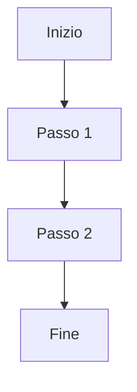

### Esercizio 1 - Creare un Documento Markdown di Base

**Istruzioni**:

- Inserisci un **titolo** e un **sottotitolo**.
- Aggiungi un **paragrafo introduttivo** con testo normale.
- Crea una **lista non ordinata** con almeno 3 elementi.
- Aggiungi un **link** esterno e una **citazione**.

**Soluzione**:

```markdown
# Titolo Principale
## Sottotitolo

Questo è un paragrafo introduttivo che descrive brevemente il contenuto del documento.

- Primo elemento della lista
- Secondo elemento della lista
- Terzo elemento della lista

[Visita il sito di esempio](https://www.example.com)

> Questa è una citazione d'esempio.
```

---

### Esercizio 2 - Creare una Tabella e un Blocco di Codice

**Istruzioni**:

- Crea una tabella con 3 colonne (Nome, Età, Professione) e almeno 3 righe di dati.
- Inserisci un **blocco di codice** che mostra un esempio di codice semplice (es. Python: `print("Hello, World!")`).

**Soluzione**:

```markdown
| Nome    | Età | Professione    |
|---------|-----|----------------|
| Marco   | 25  | Ingegnere      |
| Lucia   | 30  | Designer       |
| Paolo   | 28  | Sviluppatore   |
```

```python
print("Hello, World!")
```


---

### Esercizio 3 - Integrare Immagini e Equazioni

**Istruzioni**:

- Inserisci un’immagine usando l’URL di un'immagine online o un file locale.
- Scrivi un’equazione matematica semplice utilizzando la sintassi LaTeX (es. `$E=mc^2$`).

**Soluzione**:

```markdown


L'equazione di Einstein è: $E=mc^2$

```

---

### Esercizio 4 - Creare un Documento Markdown Avanzato

**Istruzioni**:

Crea un documento con:
  - Un **titolo principale** e due sottosezioni.
  - Una **lista ordinata** con passaggi numerati.
  - Un **diagramma** utilizzando un’estensione come **Mermaid** (ad es., un diagramma di flusso semplice).
  - Un **elenco di attività** con elementi completati e da completare.

**Soluzione**:

```markdown
# Titolo Principale

## Sottosezione 1
Questa è la prima sottosezione del documento.

## Sottosezione 2
Questa è la seconda sottosezione del documento.

1. Primo passaggio
2. Secondo passaggio
3. Terzo passaggio


- [ ] Attività completata
- [ ] Attività da completare
```



```

---